# Tarea4
Modelos Probabilísticos de señales y sistemas.

Thamara Montero Montoya. B64577.

Asignaciones de la tarea 4.


# Esquema de modulación BPSK para los bits presentados. 
Para realizar el esquema de modulación BPSK se cuenta con un archivo de tipo *.csv* del cual se leen los datos, en este caso, correspondientes a los bits a utilizar para el resto de código.

Según el enunciado se debe hacer uso de una frecuencia de 5000Hz por lo que se establece así y se toman 50 puntos de muestreo. Además se sabe que se debe implementar una onda portadora senoidal unitaria por lo que se define la onda portadora de la siguiente forma:

`sen = np.sin(2*np.pi*f*tp)` 

Y se obtiene la siguiente figura:


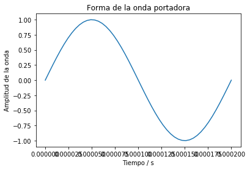

Ahora, para la modulación BPSK se define primero el vector de la señal modulada *senal*, y se define la señal modulada BPSK de la siguiente forma:

```
for k, b in enumerate(bits):
  senal[k*p:(k+1)*p] = sen if b else -sen
```

Se define visualizar los primeros 15 periodos y se obtiene la siguiente figura:

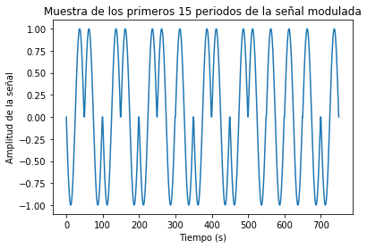


# Potencia promedio de la señal modulada generada.
```
P_inst = senal**2 #Potencia instantánea
P_prom = integrate.trapz(P_inst, t) / (N*T) #Potencia promedio a partir de la potencia instantánea
print ('La potencia promedio corresponde a: ' + str(P_prom))
```
Donde la potencia promedio, corresponde a 0.4900009800019598.


# Canal ruidoso del tipo AWGN (ruido aditivo blanco gaussiano) con una relación señal a ruido (SNR) desde -2 hasta 3 dB.

En este caso se tiene un rango donde SNR varía de -2 a 3 dB. Por lo que se crea una lista con este rango y de acuerdo a esto se simula el canal para cada uno. Utilizando el siguiente código: 
```
rang_snr = list(range(-2,4))
BER = []
for SNR in rang_snr:
    Pn = P_prom/ (10**(SNR / 10)) #Potencia del ruido para SNR y potencia de la señal dadas
    sigma = np.sqrt(P_prom) # Desviación estándar del ruido
    ruido = np.random.normal(0, sigma, senal.shape) #Crear ruido (Pn = sigma^2)
    Rx = senal + ruido #Simular "el canal": señal recibida
    
    #Visualización de los primeros bits recibidos
    pb = 15
    plt.figure(2)
    plt.plot(Rx[0:pb*p])
    plt.xlabel("Tiempo (s)")
    plt.ylabel("Amplitud de la señal")
    plt.title("Canal ruidoso en el rango de SNR entre -2dB y 3dB.")
    plt.show()
```

Cada iteración se observa de la siguiente forma:

## SNR = -2

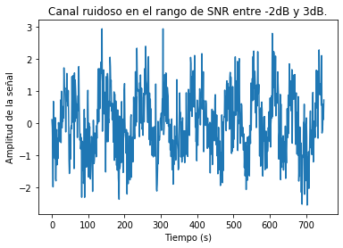

## SNR = -1

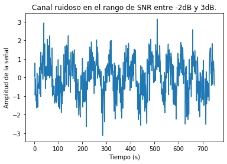

## SNR = 0


## SNR = 1

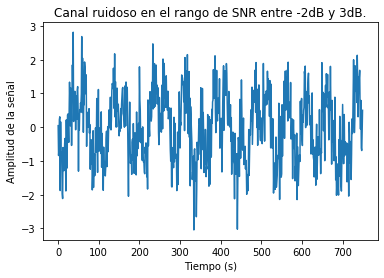

## SNR = 2

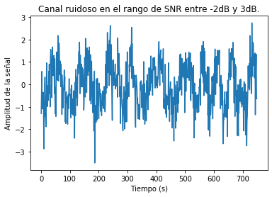

## SNR = 3

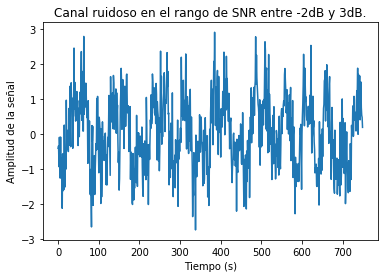


# Gráfica de la densidad espectral de potencia de la señal con el método de Welch, antes y después del canal ruidoso.
## Antes del canal ruidoso:
Para graficar antes del canal ruidoso se tiene el seguiente código:
```
    fw, PSD = signal.welch(senal, fs, nperseg=1024)
    plt.figure(3)
    plt.semilogy(fw, PSD)
    plt.xlabel('Frecuencia / Hz')
    plt.ylabel('Densidad espectral de potencia / V**2/Hz')
    plt.title("Densidad espectral de potencia antes del canal ruidoso")
    plt.show()
```
Igualmente para cada iteración se tiene lo siguiente:

### SNR = -2


### SNR = -1


### SNR = 0


### SNR = 1


### SNR = 2

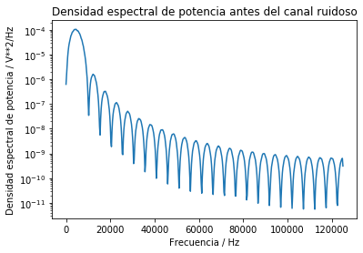

### SNR = 3


Se puede observar que todas las figuras mostradas anteriormente son iguales.

## Después del canal ruidoso:
El código utilizado para obtener las gráficas después del canal ruidoso es el siguiente:

```
    fw, PSD = signal.welch(Rx, fs, nperseg=1024)
    plt.figure(4)
    plt.semilogy(fw, PSD)
    plt.xlabel('Frecuencia / Hz')
    plt.ylabel('Densidad espectral de potencia / V**2/Hz')
    plt.title("Densidad espectral de potencia despues del canal ruidoso")
    plt.show()
```

A continuación se pueden observar las gráficas obtenidas:

### SNR = -2

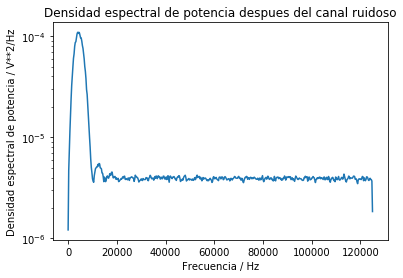

### SNR = -1

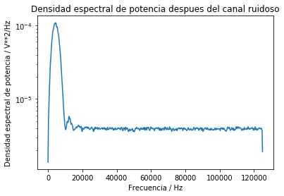

### SNR = 0

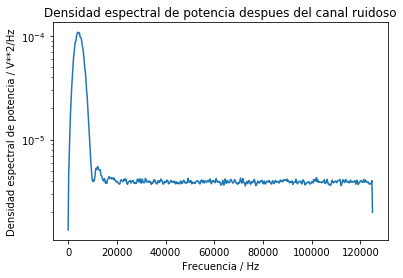

### SNR = 1

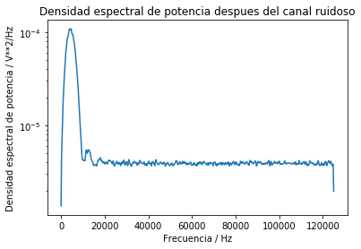

### SNR = 2


### SNR = 3

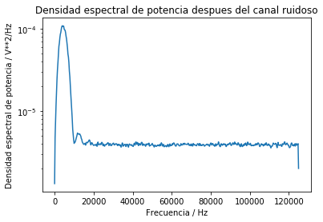

En este caso si existen varianzas entre cada una de las gráficas.

# Demodulación y decodificación de la señal y  conteo de la tasa de error de bits (BER, bit error rate) para cada nivel SNR.

## SNR = -2

## SNR = -1

## SNR = 0

## SNR = 1

## SNR = 2

## SNR = 3

# Grafica de BER versus SNR.
